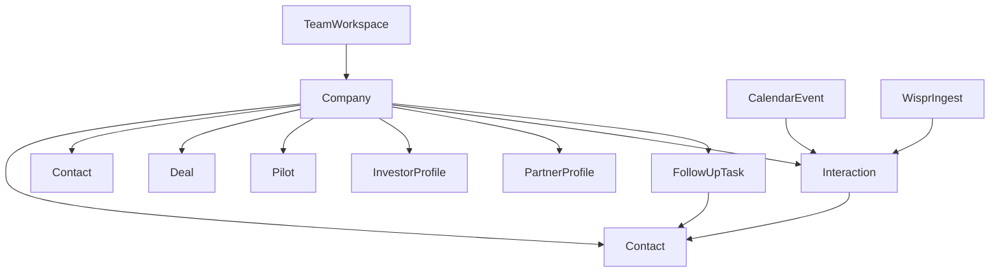

# Graft networking CRM plan

## Context and goals

[`/Users/arnavchittiprolu/GraftCrmTool`](/Users/arnavchittiprolu/GraftCrmTool) is a greenfield repo for a small Graft-Systems team CRM. It should replace spreadsheet tracking for who you have talked to, what they need, and what to do next, with shared visibility, structured follow-ups, Graft-specific pipeline objects, and multiple capture paths: manual notes, in-app voice, **calendar-linked meetings**, and **Wispr Flow** dictation (API when available).

## Locked product decisions

| Topic | Decision |
|---|---|
| Team model | Small shared workspace; every record is visible to the whole team |
| Follow-ups | Multiple tasks per record with owner, due date, and status |
| Taxonomy | Fixed relationship stages **and** free-form tags |
| Record model | **Company-first** with multiple contacts per company (see below) |
| Data entry | No day-one spreadsheet import; devs enter data manually in the app |
| Auth | No Google Workspace SSO for app login; email magic link for v1 |
| Hosting | Managed cloud on free tiers where possible (see below) |
| AI | External LLM API allowed for summarization and field extraction |
| Notifications | Email when follow-ups are due or overdue (plus in-app views) |
| Graft scope | Track deals, pilots, investors, and partners from the start |
| Calendar | Sync user calendars (Google first; Microsoft 365 as follow-up) to surface meetings and link them to companies/contacts |
| Wispr Flow | In-app capture + paste always; **Wispr Voice Interface API** when access is granted |

**Integration note:** Calendar OAuth is separate from app login (magic link). Users connect Google and/or Microsoft calendar accounts in settings after sign-in.

**Out of scope for v1:** Meeting notetaker bots that join live calls (e.g. Fireflies, Recall.ai, Zoom bot). Post-meeting notes come from manual logging, in-app voice, paste, Wispr, or calendar prompts—not automated call bots.

---

## Company-first vs person-first (what we mean)

### Person-first (not chosen)

A **person** is the main record. Company is optional text or a light link on that person.

- Good when every row in your head is “Sarah at Acme” and you rarely care about Acme without Sarah.
- Weak when three people at the same org matter, one pilot spans the org, or the company outlives any single contact.

### Company-first (chosen)

An **organization** is the main record. **People** are contacts under that organization.

**What you store on the company (account-level)**

- Name, website, domain, sector, size band, HQ or region
- **Relationship stage** (team-wide): e.g. met, exploring, active conversation, pilot, customer, partner, investor, dormant
- **Tags** (flexible): e.g. `healthcare`, `warm-intro`, `conference-2026`
- **Account owner** (primary Graft teammate)
- **Needs / priorities** at org level: problems they care about, constraints, timing
- **Graft objects** linked here: deals, pilots, investor interest, partner programs
- **Interaction timeline** at org level: calls, meetings, emails, voice notes, Wispr notes (often logged against a specific contact but visible on the company)

**What you store on each contact (person under the company)**

- Name, email, phone, LinkedIn, title/role
- **Contact role**: champion, economic buyer, technical, legal, intro source, etc.
- **Primary contact** flag when one person is the main point of contact
- Person-level notes only when they differ from the account (e.g. personal rapport, internal politics)

**How work flows in the UI**

- **Companies list** is the default hub: stage, tags, owner, last touch, open tasks, open pilots/deals.
- **Company detail** shows header + needs + Graft entities + all contacts + timeline + tasks.
- **People** is a secondary view (all contacts, filterable by company, owner, tag).
- **Follow-up inbox** still works on tasks; tasks link to a company and optionally a contact and/or deal/pilot.
- **Meetings** view (from calendar sync) shows upcoming external meetings with suggested company/contact links.

**Rules of thumb**

- Log networking against the **company** when the relationship is with the org.
- Pick a **contact** when logging who was on the call; the event still rolls up to the company timeline.
- Stages and tags on the **company** are canonical; contacts do not get conflicting “customer” vs “exploring” labels unless you add optional person-level tags later.

---

## Capture paths (how notes enter the CRM)

All paths converge on the same **interaction + AI review** pipeline before needs and tasks are committed.

| Path | Source | v1 behavior |
|---|---|---|
| Manual | User types in app | Direct interaction on company/contact |
| In-app voice | Browser mic | Transcribe → LLM structure → review → save |
| Paste / import | Wispr scratchpad or any text | Same LLM pipeline as voice |
| Wispr API | [Wispr Voice Interface API](https://api-docs.wisprflow.ai/) | Ingest dictation/scratchpad payloads → same pipeline (gated by Wispr access) |
| Calendar | Google / Microsoft events | Show upcoming meetings; match attendees to CRM; post-meeting log prompt |

**Wispr API access:** Wispr documents REST/WebSocket APIs but [general public access is limited](https://docs.wisprflow.ai/articles/2194989923-looking-to-connect-to-wispr-through-api); pursue partner/enterprise access in parallel. Until approved, rely on in-app capture and paste—no hard dependency on Wispr sync for core CRM delivery.

---

## Hosting: managed vs internal (and what is easier)

### Managed (recommended for v1)

You deploy the app and database on a vendor’s platform. They run servers, TLS, backups basics, and scaling defaults.

| Piece | Free-tier option | Role |
|---|---|---|
| App | [Vercel](https://vercel.com) Hobby | Host Next.js + webhook routes |
| Database | [Neon](https://neon.tech) free PostgreSQL **or** [Supabase](https://supabase.com) free tier | Postgres + optional file storage |
| Email | [Resend](https://resend.com) free tier **or** [Brevo](https://www.brevo.com) free tier | Magic links + due-date mail |
| AI | [Google AI Studio](https://aistudio.google.com) Gemini free tier **or** [Groq](https://groq.com) free tier | Summaries and field extraction |
| Speech (in-app) | Browser Web Speech API first | No API key for basic capture |
| Calendar | Google Calendar API / Microsoft Graph | OAuth per user; dev projects typically free at low volume |

**Why it is easier:** No VMs, no Docker on a box you maintain, no database patching. Connect GitHub → Vercel, set env vars, run Prisma migrations against Neon/Supabase. Best fit for a small dev team shipping fast.

**Tradeoffs:** Usage caps on free tiers; cold starts on serverless; vendor account required.

### Internal (self-hosted)

You run the app on hardware or cloud VMs you control (e.g. Docker on a VPS, Kubernetes, on-prem).

**Pros:** Full control, data stays in your network, no vendor hobby limits.

**Cons:** You own OS updates, TLS, backups, monitoring, cron for emails, and incident response. Higher ongoing ops burden for a small team.

**Verdict:** Use **managed hosting** for v1. Revisit self-hosting only if policy or scale requires it.

---

## Technical stack

| Layer | Choice | Cost notes |
|---|---|---|
| Framework | Next.js (App Router), React, TypeScript | Open source |
| UI | Tailwind CSS + shadcn/ui | Open source |
| ORM | Prisma | Open source |
| Auth (app) | Auth.js email magic link | Open source; email via Resend/Brevo free tier |
| Database | Neon Postgres **or** Supabase Postgres | Free tier |
| File/audio | Supabase Storage free tier **or** transcript-only storage | Optional audio retention |
| AI | Gemini or Groq free tier | Quotas; graceful degradation |
| In-app transcription | Web Speech API; optional free-tier STT | Fallback when browser quality is poor |
| Calendar | Google Calendar API v3 first; Microsoft Graph later | Per-user OAuth tokens encrypted at rest |
| Wispr | Voice Interface API when approved; webhook or poll adapter | Partner-gated; feature-flagged |
| Reminders | Vercel Cron or external cron → secured API route | Due/overdue digest emails |
| Repo / CI | GitHub + Vercel Git integration | Free for small private repos |

**Deferred (not in initial integration scope):** Google SSO for app login, Slack notifications, two-way CRM→calendar event creation, meeting notetaker bots.

---

## Domain model (detailed)

### Workspace

- Single Graft-Systems workspace in v1.
- Users: email, name, role (`member` / `admin` for later hardening).
- All companies, contacts, tasks, and Graft entities are **team-visible**.

### Company

- Identity: name, website, domain (optional unique), description.
- Taxonomy: `relationshipStage` (enum), `tags[]`.
- Ownership: `accountOwnerId` (user).
- Needs: structured fields or markdown blocks (problem, urgency, budget/timeline notes).
- Rollups: `lastInteractionAt`, counts of open tasks / active pilots / open deals (computed or cached).

**Default relationship stages (editable in settings later):**

`met` → `exploring` → `active_conversation` → `pilot` → `customer` → `partner` → `investor` → `dormant`

Use **tags** for cross-cutting labels that are not a single linear stage.

### Contact

- Belongs to one **company** (required).
- Fields: name, email, phone, linkedinUrl, title, `contactRole`, `isPrimary`, notes.
- Interactions and tasks may reference a contact while rolling up to the company.

### Interaction

- Belongs to **company**; optional `contactId`.
- Type: call, meeting, email, event, voice_note, calendar_meeting, wispr_note, other.
- `occurredAt`, body (notes), optional `transcript`, optional audio URL.
- Provenance: `source` (`manual`, `in_app_voice`, `paste`, `wispr_api`, `calendar`), external ids for idempotent webhook handling.
- Optional link: `calendarEventId`.
- AI fields (after processing): summary, extracted needs, suggested tasks (held until user confirms).

### Follow-up task

- Title, description, status (`open`, `done`, `cancelled`), `dueAt`, `ownerId`.
- Links: `companyId` (required), optional `contactId`, optional `dealId` / `pilotId`, optional source `interactionId`.
- Powers follow-up inbox and email reminders.

### Calendar connection and events

- **CalendarAccount:** user, provider (`google` | `microsoft`), tokens, sync cursor, connected at.
- **CalendarEvent:** external event id, title, start/end, attendees (email, display name), meeting URL, organizer, link to matched `companyId` / `contactId` (nullable until user confirms), `interactionId` once logged.

### Wispr integration

- **WisprConnection** (when API access granted): API credentials, user mapping, last sync cursor.
- Ingested payloads stored as draft interactions with `source = wispr_api` until reviewed.

### Graft entities (from day one)

**Deal** — sales or partnership opportunity tied to a company: name, stage, value estimate (optional), expected close, owner, notes.

**Pilot** — evaluation or proof-of-concept: status, start/target end, success criteria, owner, linked company (and optional deal).

**Investor profile** — when the company (or contact) is investor-related: fund name, check size band, thesis tags, warm intro source, next investor-specific step. Can be a flag + fields on company or a dedicated `Investor` extension row per company.

**Partner profile** — partnership track: partner type, program status, integration notes, owner.

Keep v1 schemas **flat and usable** (not a full Salesforce clone). Link all four to company; show consolidated panels on company detail.

### Activity

- Append-only events: stage changes, task completed, interaction logged, AI note applied, owner reassigned, calendar linked, Wispr ingest.
- Shown on company timeline and optionally global “recent activity” for the team.

---

## UX map

1. **Follow-up inbox (home)** — overdue, due today, this week, unassigned; filter by owner; email deep links.
2. **Companies** — table/cards: stage, tags, owner, last touch, open tasks, pilot/deal badges.
3. **Company detail** — needs, contacts, deals, pilots, investor/partner panels, timeline, tasks, quick actions (log interaction, add task, voice note, link meeting).
4. **Contacts** — all people with company column; jump to company.
5. **Deals / Pilots / Investors / Partners** — list views + create from company detail.
6. **Meetings** — upcoming calendar events, suggested CRM links, “log meeting” action.
7. **Integrations** — connect calendar and Wispr (when available); webhook status and recent deliveries.
8. **Quick capture** — add company + primary contact + first task in one flow.
9. **Unified note review** — record, paste, or Wispr ingest → transcribe (if needed) → AI review → apply to interaction + optional tasks.

---

## Delivery phases

### Phase 0 — Foundation and deployment path

**Outcome:** Runnable app skeleton, database, auth, Graft shell, empty dashboard.

- Scaffold Next.js, TypeScript, Tailwind, shadcn/ui, ESLint/Prettier.
- Prisma schema v0: `User`, `Workspace`, `Company`, `Contact` (minimal fields).
- Neon or Supabase Postgres; migration and seed (stages, sample company).
- Auth.js magic link (Resend/Brevo); allowlist teammate emails in env for v1.
- Protected `(dashboard)` layout: sidebar, Graft branding, sign-out.
- Document env vars and Vercel deploy steps in repo.
- **Exit criteria:** Teammate can sign in and see an empty companies page.

### Phase 1 — Company-first CRM core

**Outcome:** Team can manage organizations and contacts with stages and tags.

- Company CRUD, list filters (stage, tag, owner, stale last-touch).
- Contact CRUD under company; primary contact flag.
- Company detail page (header, needs, contacts list).
- Settings: stage list (seeded defaults), tag autocomplete from existing tags.
- Search across company name, domain, contact name, notes.
- **Exit criteria:** Add a company, two contacts, stage and tags, find them via search/filters.

### Phase 2 — Interactions, needs, and follow-up inbox

**Outcome:** Replace spreadsheet “last note” and “next step” with structured work.

- Interaction logging on company (+ optional contact).
- Needs panel on company (edit + show on list hover/detail).
- Follow-up tasks: create, assign owner, due date, status, link to company/contact.
- Inbox views: my tasks, overdue, due today/week, unassigned.
- Activity feed on company from interactions and task changes.
- **Exit criteria:** Log a call, create two tasks with owners and dates, clear them from inbox.

### Phase 3 — Graft entities (deals, pilots, investors, partners)

**Outcome:** Company record reflects Graft-specific pipeline, not only generic networking.

- Data model + API for Deal, Pilot, Investor extension, Partner extension.
- Company detail sections per entity; create/edit modals.
- List pages with filters (e.g. active pilots, open deals, investor stage).
- Tasks can link to deal/pilot; timeline shows entity milestones.
- **Exit criteria:** One company with an active pilot, an open deal, and investor/partner metadata visible to the team.

### Phase 4 — In-app voice, paste, and shared AI review pipeline

**Outcome:** Wispr-style capture in the browser plus one reusable AI path for all note sources.

- Browser recorder on company/contact; paste-text fallback (Wispr scratchpad workflow).
- Transcript via Web Speech API and/or free-tier STT if needed.
- Server-side LLM: summary, needs bullets, suggested tasks, optional stage/tag hints.
- Review screen: edit before save; apply to interaction + optional tasks.
- Store transcript on interaction; audio optional (Supabase bucket or transcript-only).
- **Exit criteria:** Voice or paste → review → saved interaction and optional tasks on company timeline.

### Phase 5 — Calendar sync

**Outcome:** Meetings visible in the CRM and tied to the right companies/contacts.

- Google Calendar OAuth connect/disconnect in Integrations settings.
- Sync upcoming (and recent) events per user; store `CalendarEvent` rows.
- Match attendees to contacts/companies by email domain and exact email; flag unmatched externals.
- **Meetings** page: today / week, suggested links, confirm or override company/contact.
- Post-meeting prompt: create interaction and optional follow-up tasks from event metadata.
- **Exit criteria:** Connected calendar shows external meeting; user confirms CRM link; interaction created from event.

### Phase 6 — Wispr Flow API

**Outcome:** Dictation from Wispr lands in the CRM without manual paste when API access exists.

- Apply for Wispr API / partnership; implement behind feature flag.
- `WisprConnection` + ingest adapter (webhook or poll per Wispr docs).
- Map Wispr user to Graft user; attach ingest to company/contact (user picks default or per-note).
- Reuse Phase 4 AI review; mark `source = wispr_api`.
- Keep paste and in-app capture if API is unavailable or rate-limited.
- **Exit criteria:** Wispr-sourced note creates draft interaction; user reviews and saves to timeline.

### Phase 7 — Email notifications and team operations

**Outcome:** Follow-ups and meeting prep surface outside the app.

- Daily (or configurable) job: due today / overdue tasks per owner.
- Email via Resend/Brevo: grouped digest with links to inbox, company, and optional “meetings today.”
- Reassignment and owner change on company/task; show last editor on key fields.
- Optional comments on company or interaction for handoffs.
- **Exit criteria:** Overdue task triggers email to owner; link opens correct task in app.

### Phase 8 — Hardening and launch

**Outcome:** Safe enough for daily team use.

- Admin allowlist / invite flow; basic `admin` vs `member` if needed.
- Rate limits on AI, auth, and webhook routes; friendly errors when quotas exhausted.
- Export companies + contacts + tasks (CSV).
- Webhook delivery logs for calendar/Wispr; replay or manual reconcile for failures.
- Backup note: Neon/Supabase automatic backups on free tier; document restore expectations.
- Smoke tests on critical paths; lightweight monitoring (Vercel analytics or similar free).
- **Exit criteria:** Deployed URL, two teammates onboarded, runbook for env, migrations, and integrations.

---

## Suggested repository layout

- [`package.json`](/Users/arnavchittiprolu/GraftCrmTool/package.json), [`prisma/schema.prisma`](/Users/arnavchittiprolu/GraftCrmTool/prisma/schema.prisma)
- [`src/app/(auth)/`](/Users/arnavchittiprolu/GraftCrmTool/src/app/(auth)/) — magic link login
- [`src/app/(dashboard)/`](/Users/arnavchittiprolu/GraftCrmTool/src/app/(dashboard)/) — inbox, companies, contacts, deals, pilots, meetings
- [`src/app/api/webhooks/`](/Users/arnavchittiprolu/GraftCrmTool/src/app/api/webhooks/) — Wispr (when enabled)
- [`src/app/api/cron/`](/Users/arnavchittiprolu/GraftCrmTool/src/app/api/cron/) — reminders, calendar sync
- [`src/components/`](/Users/arnavchittiprolu/GraftCrmTool/src/components/) — UI by domain (`companies/`, `competitions/`, `work/`, `capture/`, `meetings/`, etc.)
- [`src/server/actions/`](/Users/arnavchittiprolu/GraftCrmTool/src/server/actions/) — server mutations (companies, calendar, work, …)
- [`src/components/voice/`](/Users/arnavchittiprolu/GraftCrmTool/src/components/voice/) — recorder, transcript review
- [`src/components/meetings/`](/Users/arnavchittiprolu/GraftCrmTool/src/components/meetings/) — calendar list, link confirm
- [`src/components/integrations/`](/Users/arnavchittiprolu/GraftCrmTool/src/components/integrations/) — connect cards, status
- [`src/lib/db/`](/Users/arnavchittiprolu/GraftCrmTool/src/lib/db/), [`src/lib/ai/`](/Users/arnavchittiprolu/GraftCrmTool/src/lib/ai/), [`src/lib/email/`](/Users/arnavchittiprolu/GraftCrmTool/src/lib/email/), [`src/lib/voice/`](/Users/arnavchittiprolu/GraftCrmTool/src/lib/voice/), [`src/lib/calendar/`](/Users/arnavchittiprolu/GraftCrmTool/src/lib/calendar/), [`src/lib/wispr/`](/Users/arnavchittiprolu/GraftCrmTool/src/lib/wispr/)

---

## Open decisions (pick before build)

1. **Calendar:** Google-only for v1 or Google + Microsoft in the same phase.
2. **Auto-link vs confirm:** Always require human confirm when matching calendar attendees to companies.
3. **Wispr:** Start partner application immediately vs defer until after Phase 5.

---

## Risks and mitigations

| Risk | Mitigation |
|---|---|
| Free-tier email/AI limits | Batch digest emails; cache AI results; show clear “try again later” |
| Wispr API access delayed | In-app capture + paste; Phase 6 feature-flagged |
| Wrong company on calendar match | Human confirm before write; show attendee evidence |
| Webhook duplicates or missed events | Idempotent external ids; delivery log + manual replay |
| Company-first feels heavy for one-off people | Quick capture creates company + contact together |
| AI wrong on needs/tasks | Mandatory review step before write |
| Scope creep | Ship Phases 0–2 before calendar and Wispr API |

---

## Definition of done (overall v1)

- Team signs in with email magic link (no SSO for app auth).
- All data team-visible; companies are the hub with multiple contacts each.
- Stages and tags on companies; multiple owned tasks with due dates.
- Deals, pilots, investors, and partners tracked per company.
- In-app voice or paste → AI-assisted interaction and optional tasks.
- Calendar connected; meetings listed with CRM linking and post-meeting logging.
- Wispr API integrated when access is granted; paste remains as fallback.
- Due/overdue follow-ups emailed to owners.
- Deployed on managed hosting with documented setup for core app and integrations.

---

## Implementation checklist

- [ ] Phase 0: Scaffold app, DB, magic-link auth, dashboard shell, deploy docs
- [ ] Phase 1: Companies, contacts, stages, tags, search and filters
- [ ] Phase 2: Interactions, needs, tasks, inbox, activity feed
- [ ] Phase 3: Deals, pilots, investors, partners on company records
- [ ] Phase 4: In-app voice/paste, shared AI review-and-apply pipeline
- [x] Phase 5: Google Calendar sync (demo mode + scaffolding), meetings UI, attendee linking
- [x] Phase 6: Wispr API adapter (demo mode + signed webhook scaffold), ingest + review
- [x] Phase 7: Daily digest cron + Resend/outbox, task reassignment in inbox + activity log, company comments
- [ ] Phase 8: Allowlist, export, webhook logs, limits, smoke tests, launch runbook
